# ALgorithmic_Trading_with_ML
An algorithmic trading bot that learns and adapts to new data and evolving markets using Financial Python Programming and Machine Learning.

The following steps are followed :

* Establishing a Baseline Performance
* Tuning the Baseline Trading Algorithm
* Evaluating a New Machine Learning Classifier
* Creating an Evaluation Report

---

## Establishing a Baseline Performance

1) Importing the OHLCV dataset into a Pandas DataFrame.

2) Trading signals are created using short- and long-window SMA values.

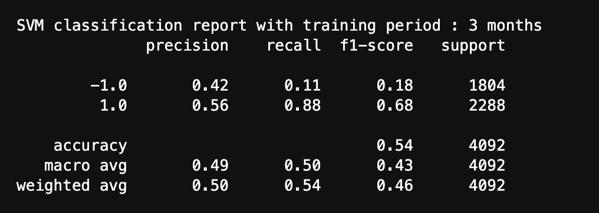

3) The data is splitted into training and testing datasets.

4) Using the SVC classifier model from SKLearn's support vector machine (SVM) learning method to fit the training data and making predictions based on the testing data. Reviewing the predictions.

5) Reviewing the classification report associated with the SVC model predictions.

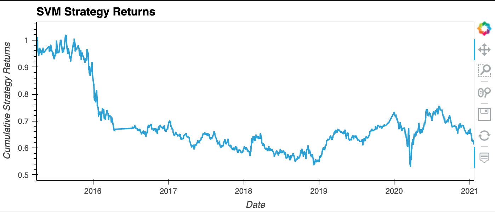

6) Creating a predictions DataFrame that contains columns for “Predicted” values, “Actual Returns”, and “Strategy Returns”.

7) Creating a cumulative return plot that shows the actual returns vs. the strategy returns. Save a PNG image of this plot. This will serve as a baseline against which to compare the effects of tuning the trading algorithm.

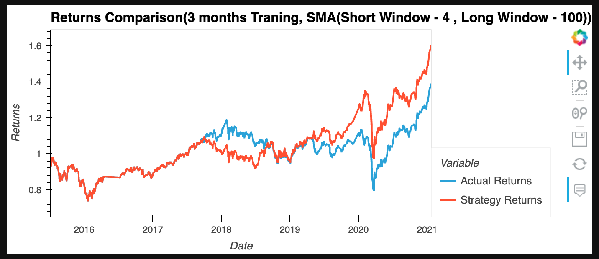

---

## Tune the Baseline Trading Algorithm

The model’s input features are tuned to find the parameters that result in the best trading outcomes. The cumulative products of the strategy returns are compared. Below steps are followed:

1) The training algorithm is tuned by adjusting the size of the training dataset. To do so, slice your data into different periods.

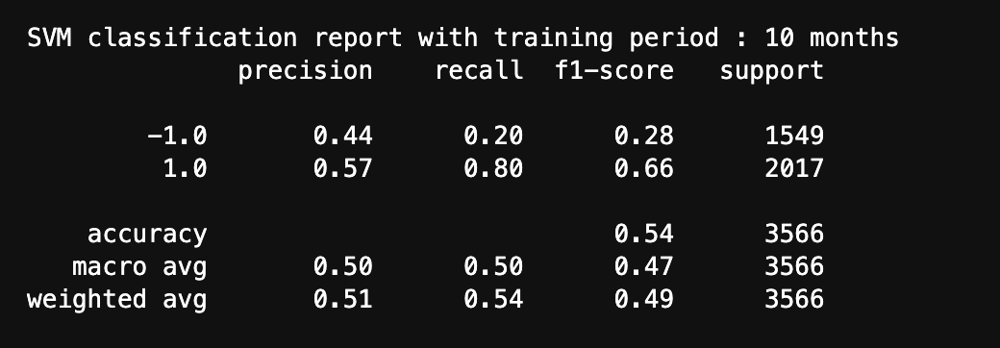
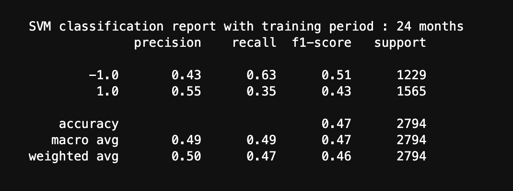
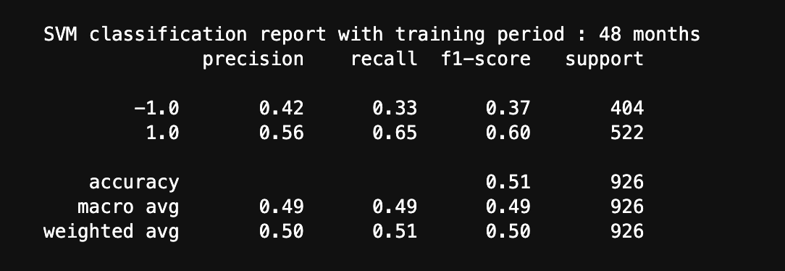

Answer the following question: What impact resulted from increasing or decreasing the training window?

Increasing the training dataset size alone did not improve the returns prediction. The precision and recall values for class `-1 ` improved with increase in training set data and presion and recall values for class `1 ` decreased compared to the original training daatset size(3 months)

2) The trading algorithm is tuned by adjusting the SMA input features. Adjusting one or both of the windows for the algorithm.

Answer the following question: What impact resulted from increasing or decreasing either or both of the SMA windows?

* Increasing the short window for SMA increased impacted the precision and recall scores. It improves these scores till certain limit and then the scores decreases. 
* While increasing the short window when we equally incresase the long window we could achieve optimal maximized scores.
* Another interesting obervation is that when the training dataset increses the short window and long window has to be incresed to get maximum output.

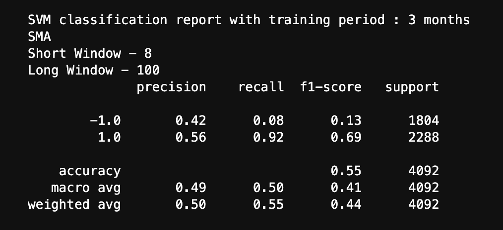

The set of parameters that best improved the trading algorithm returns.
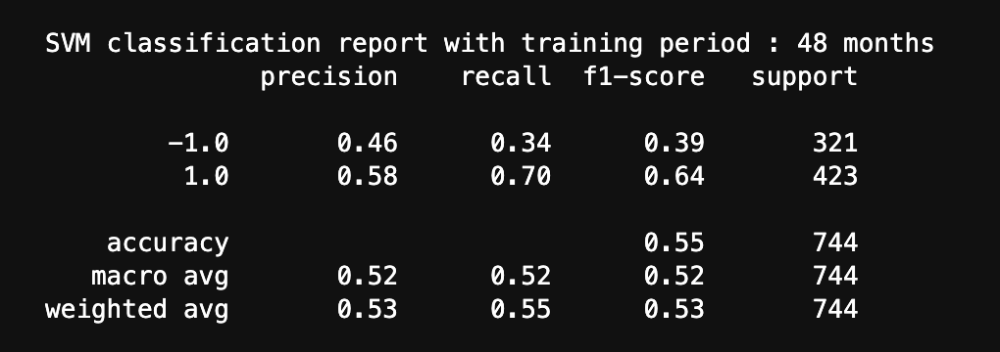
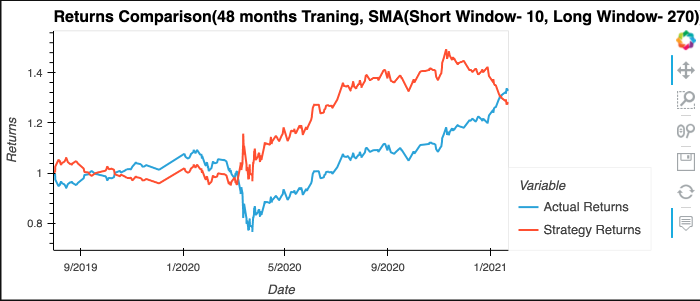

---

## Evaluating a New Machine Learning Classifier
The original parameters are applied to a second machine learning model to find its performance. To do so, below steps are followed:

1) Importing a new classifier, we chose LogisticRegression as our new classifier.

2) Using the original training data we fit the Logistic regression model.

3) The Logistic Regression model is backtested to evaluate its performance.

Answer the following questions: Did this new model perform better or worse than the provided baseline model? Did this new model perform better or worse than your tuned trading algorithm?

This new model performed good but not as well as our provided baseline model or the tuned trading algorithm.

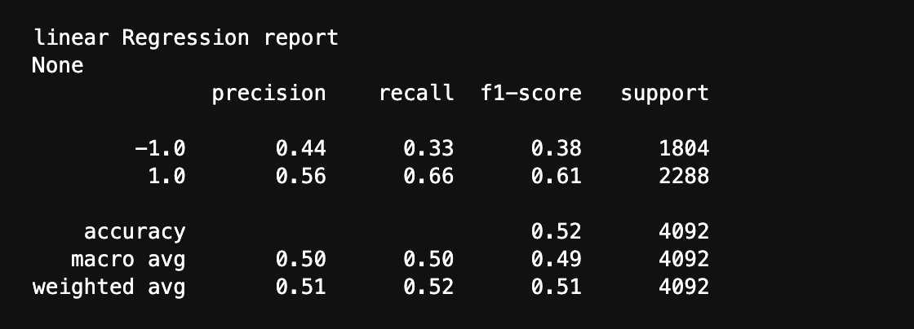
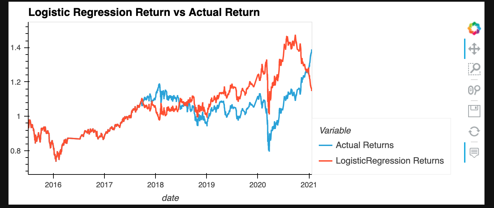

